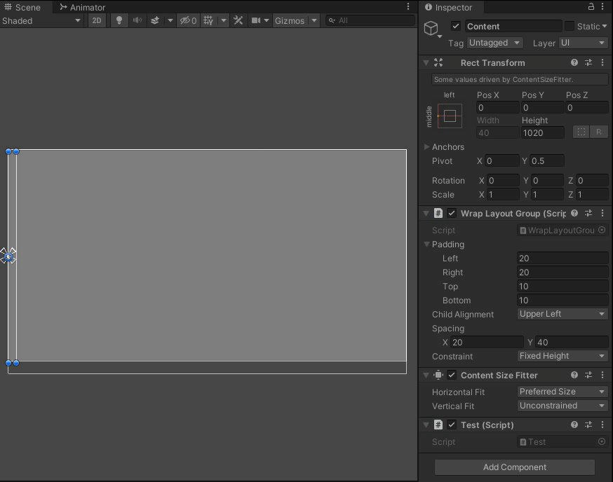
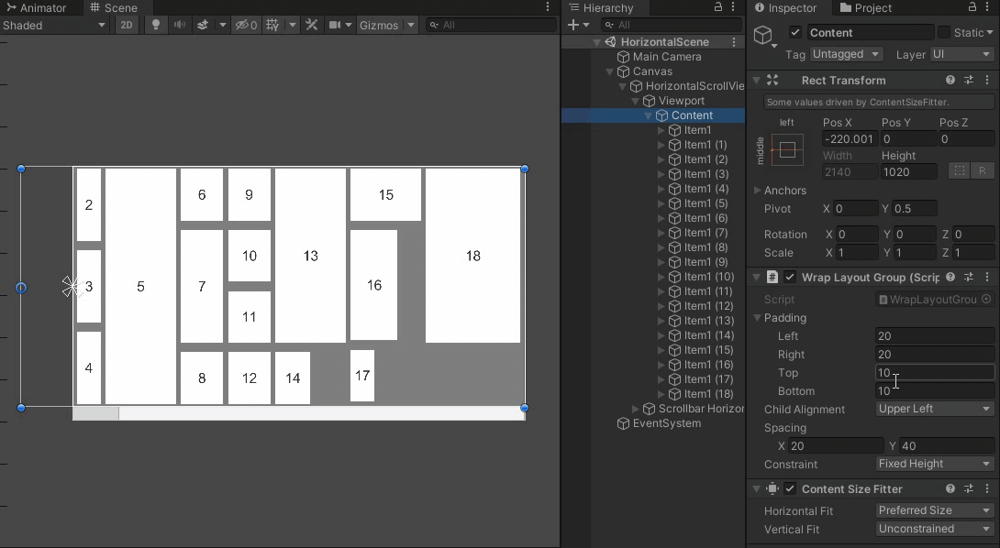

# WrapLayoutGroup

### 轴的概念

以约束类型是以宽为约束时举例：

+ 一个轴就是一行，一个容器包含多个轴，一个轴又包含多个元素

+ 轴的限制宽度以容器的宽度(支持Padding)为准，轴的实际宽度则是等于内部元素的宽度之和加横向间距之和，轴的实际高度是内部元素的最高高度

+ 在自动排列时，会将元素一个一个尝试加入轴，当轴的实际宽度超过限制宽度时，则会触发Wrap操作来创建一个新轴，Wrap规则为：
    > 1. 该轴仅有当前元素，且元素本身宽度超过了限制宽度，或元素本身宽度加上横向间距之后超过限制宽度，该轴结束，该轴高度宽度为这个元素的高端和宽度，开始一个新轴
    > 2. 该轴已经有其它元素，如果加上这个元素的宽度超过了限制宽度，则这个元素不能加入该轴，该轴应该在上一个元素结束，开始一个新轴并在其中加入当前元素
    > 3. 该轴已经有其它元素，如果加上这个元素的宽度没有超过限制宽度，但加上横向间距之后超过了，该轴结束，开始一个新轴

### 现在的功能限制

+ 严格按照元素的节点顺序进行排列

+ 约束类型决定排布方向：以宽为约束时，只能横向排列；以高为约束时，只能纵向排列

+ 不支持Start Corner功能：以宽为约束时，只能元素从左到右排列，轴从上到下排列；以高为约束时，只能元素从上到下排列，轴从左到右排列

+ 对于元素，需要接管元素的锚点和位置，但不会控制大小

+ 如果需要在布局上增加ContentSizeFilter组件：以宽为约束时，横向必须Unconstrained；以高为约束时，竖向必须Unconstrained

+ Child Alignment会对轴和内部元素同时生效

### 示例
> 在布局中增加、删减元素
> 
> 修改布局中的元素或参数
> 